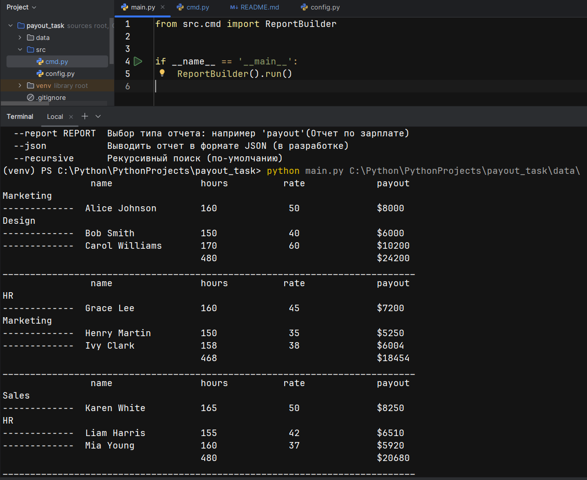

Документация проекта: Генератор отчета по зарплатам из CSV-файлов

Описание проекта.
Данный проект предназначен для автоматической обработки CSV-файлов, расположенных в указанной директории, и формирования сводного отчета по зарплатам сотрудников. Скрипт запускается из командной строки и выводит итоговую таблицу в консоль.

Проект спроектирован с учетом масштабируемости, что позволяет легко добавлять новые типы отчетов или расширять функциональность.

Использование:
python main.py <путь_до_директории>
где <путь_до_директории> — путь к папке, содержащей CSV-файлы для обработки.
python main.py -h — вывод подсказки.

Основные функции
Поиск всех CSV-файлов в указанной директории.
Чтение данных из каждого файла.
Обработка данных для формирования отчета по зарплате.
Вывод итоговой таблицы в консоль.

(Скриншот запуска программы)

